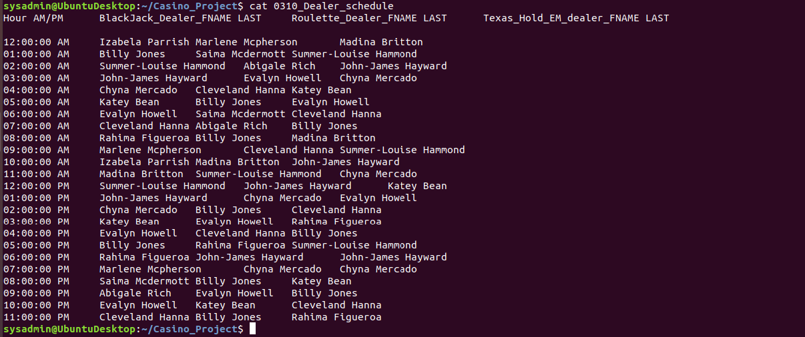
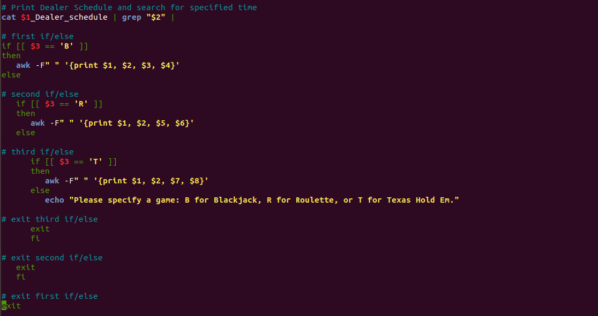
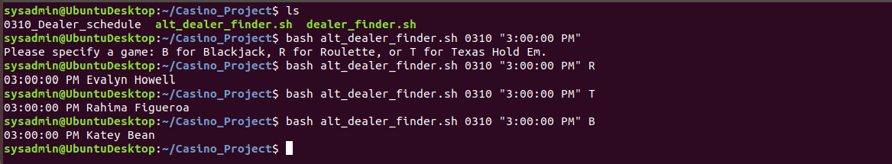

# Linux Scripts

This document contains the following details:
- Summary
- Project Scenario
    - [Basic Dealer Finder Script](dealer_finder.sh)
    - [Advanced Dealer Finder Script](alt_dealer_finder.sh)
- Additional Linux Scripts
    - [Backup (System Administration)](Scripts/backup.sh)
    - [Cleanup (System Administration)](Scripts/cleanup.sh)
    - [My Script (Variables and Command Expansion)](Scripts/my_script.sh)
    - [System (System Administration)](Scripts/system.sh)
    - [Update (System Administration)](Scripts/update.sh)

---

### Summary
This document will focus on two Bash scripts used to identify casino employees from a schedule based on arguments provided by a user.
- The first script `dealer_finder.sh` takes 2 arguments and is very basic.
- The second script `alt_dealer_finder.sh` is more complex and makes use of nested if/else statements to accept 3 arguments.
- Both scripts work with the employee schedules located in the `Dealer_schedules` folder.

There are several other standalone scripts located in the `Scripts` folder.
 - These scripts provide a variety of administrative functions and are covered in the Additional Linux Scripts section.

---

### Project Scenario

A casino has lost a significant amount of money on roulette tables over the last month and believes a player is working with a dealer to steal money. The casino has a large database with data on wins and losses, player analysis, and dealer schedules. You are tasked with building a shell script that can easily analyze future employee schedules to determine which employee was working roulette at a specific time in the case of future losses.

- The image below shows the format of `0310_Dealer_schedule.txt`, the employee schedule for March 10th.

---

#### Basic Dealer Finder Script

**Task**: Design the shell script to accept the following two arguments:
- One for the date (four digits)
- One for the time

Note: The argument should be able to accept a.m. or p.m.

**Solution**: To output the required information, I designed a script with 3 commands. The `dealer_finder.sh` script uses argument 1 (date) to `cat` the specified schedule. The output is then piped into a `grep` command to isolate the correct row based on argument 2 (time). Finally, an `awk` command combined with `print` displays the information to the user. Specific columns are not a variable here since the casino is looking specifically for roulette dealers. The next script will expand on this.
- Syntax: DATE is 4 digits; TIME is in parentheses with a space before AM or PM
    - bash dealer_finder.sh DATE "TIME AM/PM"
    - bash dealer_finder.sh 0310 "8:00:00 AM"

---

#### Advanced Dealer Finder Script

**Task**: In case there is future fraud on the other Lucky Duck games, create a shell script that has the three following arguments:
- Specific time
- Specific date
- Casino game being played

Note: The argument does not need to name the specific casino game.

**Solution**: The addition of a 3rd argument makes the `alt_dealer_finder.sh` much more complex. While the core statements are derived from the basic script above, they are nested in 3 if/else statements and allow the user to specify which casino game they want to check. To keep things simple, I decided argument 3 should be just 1 letter: B for Blackjack, R for Roulette, or T for Texas Hold Em. Luckily, the script will remind you of these options if you enter any other input (or none at all) for argument 3.
- Syntax: DATE is 4 digits; TIME is in parentheses with a space before AM or PM; GAME is 1 letter (B/R/T)
    - bash alt_dealer_finder.sh DATE "TIME AM/PM" GAME
    - bash alt_dealer_finder.sh 0310 "8:00:00 AM" R

---

### Additional Linux Scripts

These standalone Bash scripts provide basic administrative functions such as capturing system metrics, backups, and updates.

#### [backup.sh](Scripts/backup.sh)
- Creates archive of home directory, saves backup file names and sizes, and saves disk memory.

#### [cleanup.sh](Scripts/cleanup.sh)
- Cleans up tmp directories, clears apt cache, and clears thumbnail cache for specified users.

#### [my_script.sh](Scripts/my_script.sh)
- Basic script utilizing variables, environment variables, and command expansion.

#### [system.sh](Scripts/system.sh)
- Sends the following system information to designated backup directories:
    - Free memory
    - Disk usage 
    - List of open files
    - Free disk space

#### [update.sh](Scripts/update.sh)
- Ensures apt has all available updates, upgrades all installed packages, installs new packages, and removes unused packages and their associated configuration files.